Artigo_fosfato
================
Jorge Alonso
2023-10-31

# 1 - Preparando para as análises

## 1.1 - Carregando pacotes e limpando a memória

``` r
# Carregando pacotes
library(tidyverse)
library(bestNormalize)
library(easyanova)
library(ggpubr)
library(extrafont)
library(devEMF)
```

``` r
# Limpeza da memória
rm(list=ls(all=TRUE))
gc()
```

    ##           used  (Mb) gc trigger  (Mb) max used  (Mb)
    ## Ncells 2275142 121.6    4697850 250.9  3300429 176.3
    ## Vcells 3860871  29.5    8388608  64.0  7778308  59.4

``` r
# Importando a fonte
font_import(pattern = "DejaVuSansCondensed")
```

    ## Importing fonts may take a few minutes, depending on the number of fonts and the speed of the system.
    ## Continue? [y/n]

``` r
loadfonts()
```

## 1.2 - Carregando e organizando dados

``` r
# Carregando os dados com um separador específico (se necessário)
raw_url <- "https://raw.githubusercontent.com/jmalonso55/fosfatos/refs/heads/main/Artigo_fosfatos.csv"
dados <- read.csv(raw_url, sep = ",")
```

``` r
# Organizando dados
dados <- dados %>%
  mutate(cult = factor(cult, levels = c("Primeiro", "Segundo", "Acumulado"), ordered = TRUE)) %>% 
  mutate(trat = factor(trat, levels = c("Controle", "Bonito", "Pratápolis", "Catalão", "Arraias", "Registro", "Digestato", "Marrocos", "Argélia", "Bayóvar", "STP", "BoneChar"), ordered = TRUE))
```

## 1.3 - Estabelecendo funções e temas

``` r
# Função para verificar pressupostos e retornar a ANOVA
pressupostos <- function(y, x) {
  mod <- aov(y ~ x)
  norm <- shapiro.test(mod$residuals)
  hom <- bartlett.test(y ~ x)
  print(norm)
  print(hom)
  
  if (norm$p.value > 0.05 && hom$p.value > 0.05) {
    cat("\nResumo da ANOVA (Pressupostos atendidos):\n")
    print(summary(mod))
  } else {
    cat("Pressupostos não atendidos. Não foi possível realizar a ANOVA.\n")
  }
}
```

``` r
# Função para a média dos grupos
grupos_media <- function(cultivo, variavel, dados, label) {
  dados %>%
    filter(cult == cultivo) %>%
    group_by(trat) %>%
    summarise(!!label := mean(.data[[variavel]], na.rm = TRUE), .groups = "drop")
}
```

``` r
# Função para a eficiência relativa
eficiencia_relativa <- function(x, dat) {
  controle <- dat %>% filter(trat == "Controle") %>% pull(mspa)
  stp <- dat %>% filter(trat == "STP") %>% pull(mspa)
  round((x - controle) * 100 / (stp - controle), 2)
}
```

``` r
# Função para a eficiência no acúmulo de fósforo
eficiencia_fosforo <- function(x, dat) {
  controle <- dat %>% filter(trat == "Controle") %>% pull(ap)
  stp <- dat %>% filter(trat == "STP") %>% pull(ap)
  round((x - controle) * 100 / (stp - controle), 2)
}
```

``` r
# Estabelecendo tema para o gráfico
tema <- theme(panel.background = element_rect(fill = "gray97"),
        panel.grid.major.x = element_line(color = "grey85", linetype = "dotted"),
        panel.grid.major.y = element_line(color = "grey85", linetype = "dotted"),
        strip.background = element_blank(), 
        legend.position = "none",
        axis.title.y = element_text(margin = margin(r = 10)),
        axis.title.x = element_text(margin = margin(t = 10)),
        text = element_text(family = "DejaVu Sans Condensed", size = 26),
        axis.text = element_text(size = 16),
        strip.text = element_text(size = 22))
```

``` r
# Estabelecendo outro tema para o gráfico
tema2 <- theme(text = element_text(family = "DejaVu Sans Condensed", size = 14), 
         axis.text = element_text(family="DejaVu Sans Condensed"),
         panel.grid.major.x = element_line(color = "grey85", linetype = "dotted"),
         panel.background = element_rect(fill = "gray97"),
         strip.background = element_blank(), 
         legend.position = "none",
         axis.title.y = element_text(margin = margin(r = 10)),
         axis.title.x = element_text(margin = margin(t = 10)),
         panel.spacing = unit(2, "lines"),
         strip.text = element_text(size = 14))
```

``` r
# Estabelecendo padrões para gráficos
facet <- c("Primeiro" = "First crop", "Segundo" = "Second crop", "Acumulado" = "Accumulated in two crops")
cores <- c("#9e2943", "#0a6c69", "#75a741", "#d18525", "#d86c67", "#5ab5b2")
eixo_x <- c("Control", "Bonito", "Pratápolis", "Catalão", "Arraias", "Registro", "ERCP", "Morocco", "Algeria", "Bayovar", "TSP", "Bonechar")
```

# 2 - MSPA

## 2.1 - Primeiro cultivo

``` r
# Filtrando os dados
dapri <- dados %>% filter(cult == "Primeiro")
```

### 2.1.1 - Pressupostos e ANOVA

``` r
# Análise dos pressupostos
with(dapri, pressupostos(mspa, trat))
```

    ## 
    ##  Shapiro-Wilk normality test
    ## 
    ## data:  mod$residuals
    ## W = 0.91474, p-value = 0.001949
    ## 
    ## 
    ##  Bartlett test of homogeneity of variances
    ## 
    ## data:  y by x
    ## Bartlett's K-squared = 35.854, df = 11, p-value = 0.000179
    ## 
    ## Pressupostos não atendidos. Não foi possível realizar a ANOVA.

``` r
# Transformando por log
with(dapri, pressupostos(log(mspa), trat))
```

    ## 
    ##  Shapiro-Wilk normality test
    ## 
    ## data:  mod$residuals
    ## W = 0.97673, p-value = 0.4508
    ## 
    ## 
    ##  Bartlett test of homogeneity of variances
    ## 
    ## data:  y by x
    ## Bartlett's K-squared = 17.503, df = 11, p-value = 0.09384
    ## 
    ## 
    ## Resumo da ANOVA (Pressupostos atendidos):
    ##             Df Sum Sq Mean Sq F value Pr(>F)    
    ## x           11  59.95   5.450   56.21 <2e-16 ***
    ## Residuals   36   3.49   0.097                   
    ## ---
    ## Signif. codes:  0 '***' 0.001 '**' 0.01 '*' 0.05 '.' 0.1 ' ' 1

### 2.1.2 - Comparação de médias

``` r
# Gerando uma nova tabela para receber os dados transformados
dapri_t <- dapri %>% 
  reframe(trat = trat, mspa = log(mspa))
```

``` r
# Fazendo a análise pelo easyanova
respri <- ea1(dapri_t, 1, alpha = 0.01)
```

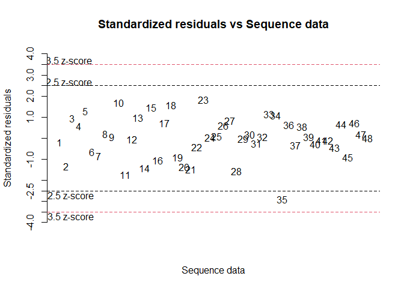<!-- -->

``` r
# Resultados do teste de médias
respri$Means
```

    ##     treatment    mean     sd    sem tukey snk duncan  t scott_knott
    ## 1    BoneChar  2.7448 0.1102 0.1557     a   a      a  a           a
    ## 2         STP  2.6374 0.1265 0.1557     a   a      a  a           a
    ## 3     Bayóvar  2.3678 0.0505 0.1557     a   a      a  a           a
    ## 4     Argélia  2.3431 0.2950 0.1557     a   a      a  a           a
    ## 5    Marrocos  1.1963 0.3762 0.1557     b   b      b  b           b
    ## 6    Registro  1.0286 0.2664 0.1557     b  bc      b  b           b
    ## 7     Arraias  0.8445 0.3745 0.1557    bc  bc     bc bc           b
    ## 8   Digestato  0.7268 0.5316 0.1557    bc  bc     bc bc           b
    ## 9     Catalão  0.3560 0.2764 0.1557   bcd  cd     cd cd           b
    ## 10   Controle  0.0364 0.1839 0.1557    ce  de     de de           c
    ## 11 Pratápolis -0.3196 0.3928 0.1557    de  de     ef ef           c
    ## 12     Bonito -0.5881 0.3820 0.1557     e   e      f  f           c

## 2.2 - Segundo cultivo

``` r
# Filtrando os dados
daseg <- dados %>% filter(cult == "Segundo")
```

### 2.2.1 - Pressupostos e ANOVA

``` r
# Análise dos pressupostos
with(daseg, pressupostos(mspa, trat))
```

    ## 
    ##  Shapiro-Wilk normality test
    ## 
    ## data:  mod$residuals
    ## W = 0.90043, p-value = 0.0006493
    ## 
    ## 
    ##  Bartlett test of homogeneity of variances
    ## 
    ## data:  y by x
    ## Bartlett's K-squared = 46.977, df = 11, p-value = 2.171e-06
    ## 
    ## Pressupostos não atendidos. Não foi possível realizar a ANOVA.

``` r
# Transformando por log
with(daseg, pressupostos(log(mspa), trat))
```

    ## 
    ##  Shapiro-Wilk normality test
    ## 
    ## data:  mod$residuals
    ## W = 0.98532, p-value = 0.8041
    ## 
    ## 
    ##  Bartlett test of homogeneity of variances
    ## 
    ## data:  y by x
    ## Bartlett's K-squared = 17.159, df = 11, p-value = 0.1033
    ## 
    ## 
    ## Resumo da ANOVA (Pressupostos atendidos):
    ##             Df Sum Sq Mean Sq F value   Pr(>F)    
    ## x           11 20.350  1.8500   13.09 1.63e-09 ***
    ## Residuals   36  5.087  0.1413                     
    ## ---
    ## Signif. codes:  0 '***' 0.001 '**' 0.01 '*' 0.05 '.' 0.1 ' ' 1

### 2.2.2 - Comparação de médias

``` r
# Gerando uma nova tabela para receber os dados transformados
daseg_t <- daseg %>% 
  reframe(trat = trat, mspa = log(mspa))
```

``` r
# Fazendo a análise pelo easyanova
reseg <- ea1(daseg_t, 1, alpha = 0.01)
```

<!-- -->

``` r
# Resultados do teste de médias
reseg$Means
```

    ##     treatment    mean     sd   sem tukey snk duncan  t scott_knott
    ## 1    BoneChar  1.6299 0.5739 0.188     a   a      a  a           a
    ## 2         STP  1.2005 0.4391 0.188    ab  ab     ab ab           a
    ## 3    Marrocos  1.1695 0.3586 0.188    ab  ab     ab ab           a
    ## 4   Digestato  1.0473 0.1072 0.188    ab  ab     ab ac           a
    ## 5     Bayóvar  0.8428 0.4632 0.188    ab  ab     ab bc           b
    ## 6     Argélia  0.7840 0.2905 0.188    ab  ab      b bc           b
    ## 7     Catalão  0.6935 0.3998 0.188    ab  ab      b bc           b
    ## 8    Registro  0.6852 0.4128 0.188    ab  ab      b bc           b
    ## 9  Pratápolis  0.5079 0.3182 0.188     b   b      b bc           b
    ## 10     Bonito  0.4968 0.4061 0.188     b   b      b bc           b
    ## 11    Arraias  0.4337 0.3705 0.188     b   b      b  c           b
    ## 12   Controle -1.1587 0.0314 0.188     c   c      c  d           c

## 2.3 - Acumulado

``` r
# Análise dos pressupostos
dac <- dados %>% filter(cult == "Acumulado")
```

### 2.3.1 - Pressupostos e ANOVA

``` r
# Análise dos pressupostos
with(dac, pressupostos(mspa, trat))
```

    ## 
    ##  Shapiro-Wilk normality test
    ## 
    ## data:  mod$residuals
    ## W = 0.89422, p-value = 0.0004114
    ## 
    ## 
    ##  Bartlett test of homogeneity of variances
    ## 
    ## data:  y by x
    ## Bartlett's K-squared = 34.253, df = 11, p-value = 0.0003288
    ## 
    ## Pressupostos não atendidos. Não foi possível realizar a ANOVA.

``` r
# Transformando por log
with(dac, pressupostos(log(mspa), trat))
```

    ## 
    ##  Shapiro-Wilk normality test
    ## 
    ## data:  mod$residuals
    ## W = 0.96558, p-value = 0.1694
    ## 
    ## 
    ##  Bartlett test of homogeneity of variances
    ## 
    ## data:  y by x
    ## Bartlett's K-squared = 11.546, df = 11, p-value = 0.3987
    ## 
    ## 
    ## Resumo da ANOVA (Pressupostos atendidos):
    ##             Df Sum Sq Mean Sq F value Pr(>F)    
    ## x           11  33.81   3.074   59.16 <2e-16 ***
    ## Residuals   36   1.87   0.052                   
    ## ---
    ## Signif. codes:  0 '***' 0.001 '**' 0.01 '*' 0.05 '.' 0.1 ' ' 1

### 2.3.2 - Comparação de médias

``` r
# Gerando uma nova tabela para receber os dados transformados
dac_t <- dac %>% 
  reframe(trat = trat, mspa = log(mspa))
```

``` r
# Fazendo a análise pelo easyanova
resac <- ea1(dac_t, 1, alpha = 0.01)
```

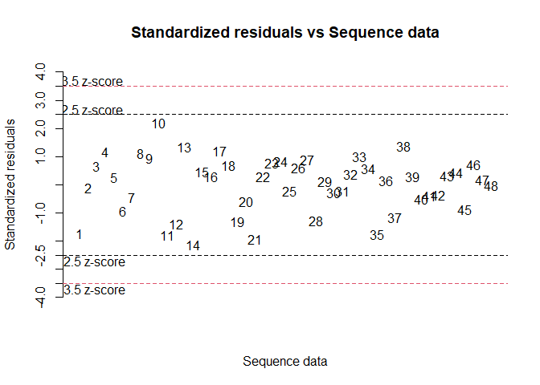<!-- -->

``` r
# Resultados do teste de médias
resac$Means
```

    ##     treatment   mean     sd   sem tukey snk duncan  t scott_knott
    ## 1    BoneChar 3.0436 0.2174 0.114     a   a      a  a           a
    ## 2         STP 2.8688 0.0863 0.114     a   a     ab ab           a
    ## 3     Bayóvar 2.5768 0.0630 0.114     a   a      b  b           b
    ## 4     Argélia 2.5504 0.1951 0.114    ab   a      b  b           b
    ## 5    Marrocos 1.9041 0.2610 0.114    bc   b      c  c           c
    ## 6   Digestato 1.6122 0.2449 0.114     c  bc     cd cd           c
    ## 7    Registro 1.5949 0.1784 0.114     c  bc     cd cd           c
    ## 8     Arraias 1.3854 0.2294 0.114    cd  bc      d  d           d
    ## 9     Catalão 1.2517 0.2533 0.114    cd  cd     de de           d
    ## 10 Pratápolis 0.8822 0.2968 0.114    de   d     ef ef           e
    ## 11     Bonito 0.7930 0.3801 0.114    de   d      f  f           e
    ## 12   Controle 0.3040 0.1321 0.114     e   e      g  g           f

## 2.4 - Gráfico

### 2.4.1 - Adicionando resultados do teste

``` r
# Adicionando resultados do teste para os ciclos

# Primeiro
primeiro <- dados %>%
  filter(cult == "Primeiro") %>% 
  mutate(teste = case_when(
    trat == "BoneChar" ~ "a",
    trat == "STP" ~ "a",
    trat == "Bayóvar" ~ "a",
    trat == "Argélia" ~ "a",
    trat == "Marrocos" ~ "b",
    trat == "Digestato" ~ "b",
    trat == "Registro" ~ "b",
    trat == "Arraias" ~ "b",
    trat == "Catalão" ~ "b",
    trat == "Pratápolis" ~ "c",
    trat == "Bonito" ~ "c",
    trat == "Controle" ~ "c",
    TRUE ~ as.character(trat)
  ))

# Segundo
segundo <- dados %>%
  filter(cult == "Segundo") %>% 
  mutate(teste = case_when(
    trat == "BoneChar" ~ "a",
    trat == "STP" ~ "a",
    trat == "Bayóvar" ~ "b",
    trat == "Argélia" ~ "b",
    trat == "Marrocos" ~ "a",
    trat == "Digestato" ~ "a",
    trat == "Registro" ~ "b",
    trat == "Arraias" ~ "b",
    trat == "Catalão" ~ "b",
    trat == "Pratápolis" ~ "b",
    trat == "Bonito" ~ "b",
    trat == "Controle" ~ "c",
    TRUE ~ as.character(trat)
  ))

# Acumulado
acumulado <- dados %>%
  filter(cult == "Acumulado") %>% 
  mutate(teste = case_when(
    trat == "BoneChar" ~ "a",
    trat == "STP" ~ "a",
    trat == "Bayóvar" ~ "b",
    trat == "Argélia" ~ "b",
    trat == "Marrocos" ~ "c",
    trat == "Digestato" ~ "c",
    trat == "Registro" ~ "c",
    trat == "Arraias" ~ "d",
    trat == "Catalão" ~ "d",
    trat == "Pratápolis" ~ "e",
    trat == "Bonito" ~ "e",
    trat == "Controle" ~ "f",
    TRUE ~ as.character(trat)
  ))

# Gerando a coluna
dados$teste <- c(primeiro$teste, segundo$teste, acumulado$teste)
```

``` r
# Calcular as médias e adicionar os rótulos
dados_resumo <- dados %>% 
  group_by(trat, cult) %>%
  summarise(mean_mspa = mean(mspa), teste = first(teste), .groups = 'drop') %>%
  mutate(label = paste0(sprintf("%.2f", mean_mspa), teste))
```

### 2.4.2 - Plotando resultados

``` r
# Boxplot para MSPA
  ggplot(data = dados, aes(x = trat, y = mspa, color = teste)) +
  geom_boxplot(size = 0.8, outlier.size = 2) +
  stat_summary(fun = mean, geom = "point", size = 5) +
  scale_color_manual(values = cores) +
  scale_y_continuous(breaks = seq(0, 45, by =5)) +
  scale_x_discrete(labels = eixo_x) +
  labs(x = "Treatments", y = expression("Shoot dry mass (g" ~ pot^-1*")")) +
  facet_wrap(~ cult, nrow = 3, ncol = 1, labeller = labeller(cult = facet)) +
  theme_classic() +
  tema
```

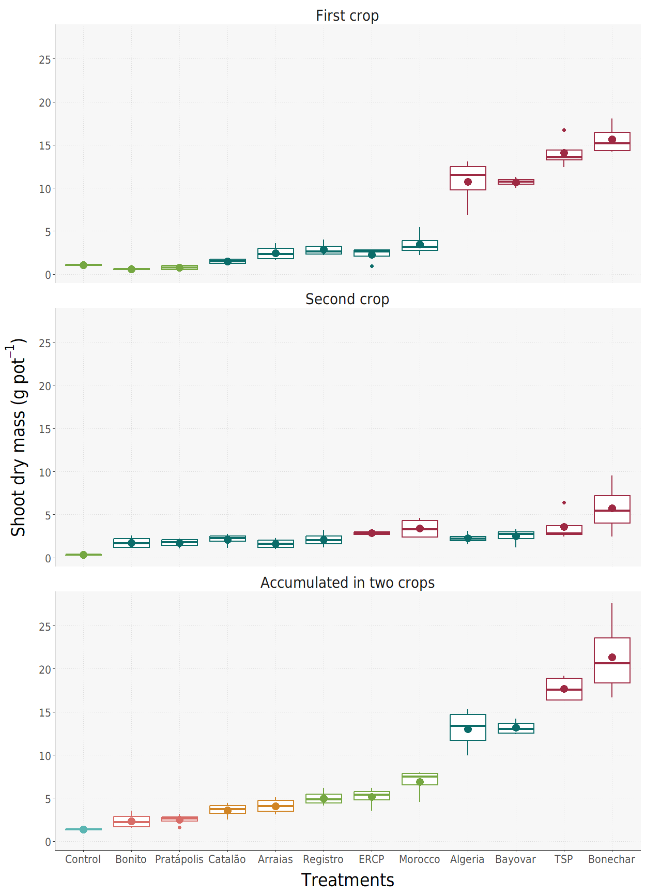<!-- -->

``` r
# Diagrama de pontos para a MSPA
ggplot(data = dados, aes(x = trat, y = mspa, color = teste)) +
  geom_point(alpha = 0.6, size = 5) +
  geom_text(data = dados_resumo, aes(x = trat, y = mean_mspa, label = label), size = 4.5, position = position_nudge(x = 0.45), fontface = "bold") +  
  stat_summary(fun = mean, geom = "point", size = 3, shape = 15) +
  scale_color_manual(values = cores) +
  scale_y_continuous(breaks = seq(0, 45, by = 5)) +
  scale_x_discrete(labels = c(eixo_x), expand = expansion(mult = c(0.05, 0.075))) +
  labs(x = "Treatments", y = expression("Shoot dry mass (g" ~ pot^-1*")")) +
  facet_wrap(~ cult, nrow = 3, ncol = 1, labeller = labeller(cult = facet)) +
  coord_flip() +
  theme_classic() +
  tema
```

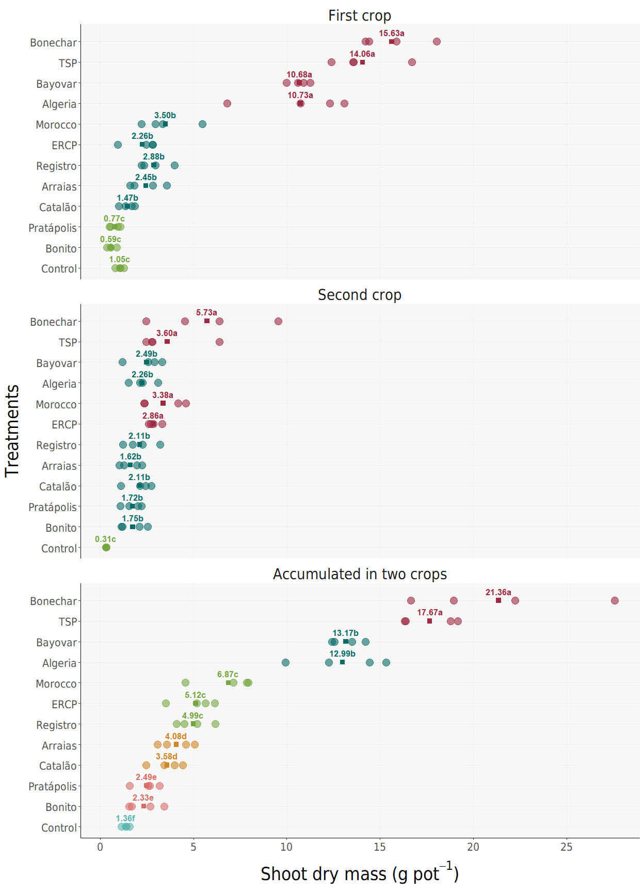<!-- -->

# 3 - APPA

## 3.1 - Primeiro cultivo

### 3.1.1 - Pressupostos e ANOVA

``` r
# Análise dos pressupostos
with(dapri, pressupostos(ap, trat))
```

    ## 
    ##  Shapiro-Wilk normality test
    ## 
    ## data:  mod$residuals
    ## W = 0.82833, p-value = 6.066e-06
    ## 
    ## 
    ##  Bartlett test of homogeneity of variances
    ## 
    ## data:  y by x
    ## Bartlett's K-squared = 54.088, df = 11, p-value = 1.138e-07
    ## 
    ## Pressupostos não atendidos. Não foi possível realizar a ANOVA.

``` r
# Transformando por log
with(dapri, pressupostos(log(ap), trat))
```

    ## 
    ##  Shapiro-Wilk normality test
    ## 
    ## data:  mod$residuals
    ## W = 0.98447, p-value = 0.7693
    ## 
    ## 
    ##  Bartlett test of homogeneity of variances
    ## 
    ## data:  y by x
    ## Bartlett's K-squared = 15.304, df = 11, p-value = 0.169
    ## 
    ## 
    ## Resumo da ANOVA (Pressupostos atendidos):
    ##             Df Sum Sq Mean Sq F value Pr(>F)    
    ## x           11  95.89   8.717   63.68 <2e-16 ***
    ## Residuals   36   4.93   0.137                   
    ## ---
    ## Signif. codes:  0 '***' 0.001 '**' 0.01 '*' 0.05 '.' 0.1 ' ' 1

### 3.1.2 - Comparação de médias

``` r
# Gerando uma nova tabela para receber os dados transformados
dapri_tp <- dapri %>% 
  reframe(trat = trat, ap = log(ap))
```

``` r
# Fazendo a análise pelo easyanova
resprip <- ea1(dapri_tp, 1, alpha = 0.01)
```

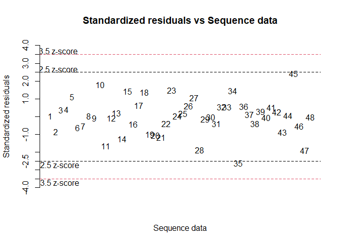<!-- -->

``` r
# Resultados do teste de médias
resprip$Means
```

    ##     treatment    mean     sd   sem tukey snk duncan  t scott_knott
    ## 1    BoneChar  3.4211 0.0947 0.185     a   a      a  a           a
    ## 2     Argélia  3.1880 0.4180 0.185     a   a      a  a           a
    ## 3     Bayóvar  2.9843 0.1276 0.185    ab   a      a  a           a
    ## 4         STP  2.7662 0.1957 0.185    ac  ab     ab ab           a
    ## 5    Marrocos  2.0851 0.3578 0.185   bcd  bc     bc bc           b
    ## 6    Registro  1.7159 0.2602 0.185    ce  cd      c cd           b
    ## 7     Arraias  1.5367 0.3888 0.185    de  cd     cd ce           b
    ## 8   Digestato  1.3693 0.5825 0.185    de  cd     cd de           b
    ## 9     Catalão  0.8854 0.1867 0.185    ef  de     de ef           c
    ## 10 Pratápolis  0.1913 0.3631 0.185    fg  ef     ef fg           c
    ## 11     Bonito -0.4660 0.4563 0.185    gh   f      f  g           d
    ## 12   Controle -1.1985 0.5859 0.185     h   g      g  h           e

## 3.2 - Segundo cultivo

### 3.2.1 - Pressupostos e ANOVA

``` r
# Análise dos pressupostos
with(daseg, pressupostos(ap, trat))
```

    ## 
    ##  Shapiro-Wilk normality test
    ## 
    ## data:  mod$residuals
    ## W = 0.85667, p-value = 3.284e-05
    ## 
    ## 
    ##  Bartlett test of homogeneity of variances
    ## 
    ## data:  y by x
    ## Bartlett's K-squared = 54.558, df = 11, p-value = 9.337e-08
    ## 
    ## Pressupostos não atendidos. Não foi possível realizar a ANOVA.

``` r
# Transformando por log
with(daseg, pressupostos(log(ap), trat))
```

    ## 
    ##  Shapiro-Wilk normality test
    ## 
    ## data:  mod$residuals
    ## W = 0.98534, p-value = 0.8048
    ## 
    ## 
    ##  Bartlett test of homogeneity of variances
    ## 
    ## data:  y by x
    ## Bartlett's K-squared = 17.033, df = 11, p-value = 0.1069
    ## 
    ## 
    ## Resumo da ANOVA (Pressupostos atendidos):
    ##             Df Sum Sq Mean Sq F value   Pr(>F)    
    ## x           11 27.431  2.4938   17.64 2.45e-11 ***
    ## Residuals   36  5.088  0.1413                     
    ## ---
    ## Signif. codes:  0 '***' 0.001 '**' 0.01 '*' 0.05 '.' 0.1 ' ' 1

### 3.2.2 - Comparação de médias

``` r
# Gerando uma nova tabela para receber os dados transformados
daseg_tp <- daseg %>% 
  reframe(trat = trat, ap = log(ap))
```

``` r
# Fazendo a análise pelo easyanova
resegp <- ea1(daseg_tp, 1, alpha = 0.01)
```

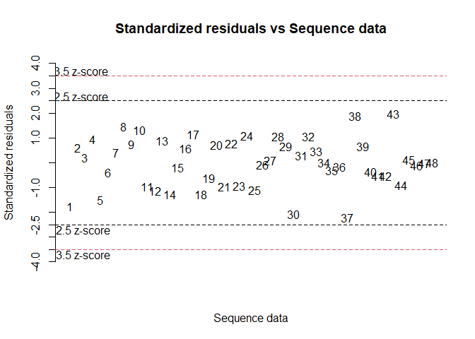<!-- -->

``` r
# Resultados do teste de médias
resegp$Means
```

    ##     treatment    mean     sd   sem tukey snk duncan  t scott_knott
    ## 1    BoneChar  2.0746 0.5738 0.188     a   a      a  a           a
    ## 2   Digestato  1.6944 0.1072 0.188    ab  ab     ab ab           a
    ## 3         STP  1.3489 0.4390 0.188    ac  ac     ac bc           a
    ## 4    Marrocos  1.3266 0.3586 0.188    ac  ac     ac bc           a
    ## 5    Registro  1.2785 0.4128 0.188    ac  ac     bc bc           a
    ## 6     Bayóvar  1.0167 0.4632 0.188    ac  bc    bcd bd           b
    ## 7     Argélia  0.9580 0.2904 0.188    bc  bc    bcd cd           b
    ## 8     Catalão  0.6935 0.3998 0.188    bc   c     cd cd           b
    ## 9  Pratápolis  0.6818 0.3183 0.188    bc  bc     cd cd           b
    ## 10     Bonito  0.6539 0.4062 0.188    bc  bc     cd cd           b
    ## 11    Arraias  0.3501 0.3707 0.188     c   c      d  d           b
    ## 12   Controle -1.0632 0.0322 0.188     d   d      e  e           c

## 3.3 - Acumulado

### 3.3.1 - Pressupostos e ANOVA

``` r
# Análise dos pressupostos
with(dac, pressupostos(ap, trat))
```

    ## 
    ##  Shapiro-Wilk normality test
    ## 
    ## data:  mod$residuals
    ## W = 0.88629, p-value = 0.0002337
    ## 
    ## 
    ##  Bartlett test of homogeneity of variances
    ## 
    ## data:  y by x
    ## Bartlett's K-squared = 41.367, df = 11, p-value = 2.083e-05
    ## 
    ## Pressupostos não atendidos. Não foi possível realizar a ANOVA.

``` r
# Transformando por log
with(dac, pressupostos(log(ap), trat))
```

    ## 
    ##  Shapiro-Wilk normality test
    ## 
    ## data:  mod$residuals
    ## W = 0.97829, p-value = 0.5097
    ## 
    ## 
    ##  Bartlett test of homogeneity of variances
    ## 
    ## data:  y by x
    ## Bartlett's K-squared = 12.67, df = 11, p-value = 0.3154
    ## 
    ## 
    ## Resumo da ANOVA (Pressupostos atendidos):
    ##             Df Sum Sq Mean Sq F value Pr(>F)    
    ## x           11  59.68   5.425    84.5 <2e-16 ***
    ## Residuals   36   2.31   0.064                   
    ## ---
    ## Signif. codes:  0 '***' 0.001 '**' 0.01 '*' 0.05 '.' 0.1 ' ' 1

### 3.3.2 - Comparação de médias

``` r
# Gerando uma nova tabela para receber os dados transformados
dac_tp <- dac %>% 
  reframe(trat = trat, ap = log(ap))
```

``` r
# Fazendo a análise pelo easyanova
resacp <- ea1(dac_tp, 1, alpha = 0.01)
```

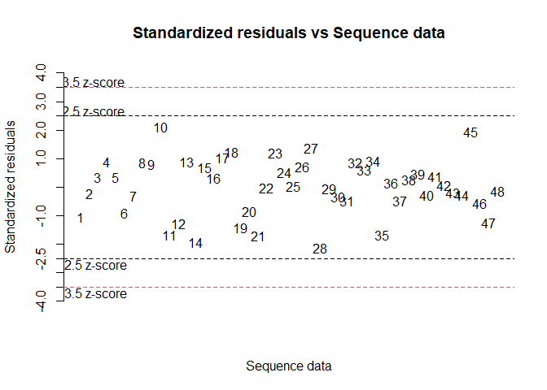<!-- -->

``` r
# Resultados do teste de médias
resacp$Means
```

    ##     treatment    mean     sd    sem tukey snk duncan  t scott_knott
    ## 1    BoneChar  3.6763 0.0970 0.1267     a   a      a  a           a
    ## 2     Argélia  3.3061 0.3382 0.1267     a  ab     ab ab           b
    ## 3     Bayóvar  3.1225 0.1330 0.1267    ab  ab      b  b           b
    ## 4         STP  3.0088 0.0659 0.1267    ab   b      b  b           b
    ## 5    Marrocos  2.4917 0.2744 0.1267    bc   c      c  c           c
    ## 6   Digestato  2.2633 0.2578 0.1267     c  cd     cd cd           c
    ## 7    Registro  2.2442 0.1711 0.1267     c  cd     cd cd           c
    ## 8     Arraias  1.8261 0.2960 0.1267    cd  de     de de           d
    ## 9     Catalão  1.5058 0.1839 0.1267    de  ef     ef ef           d
    ## 10 Pratápolis  1.1725 0.2887 0.1267    de  fg     fg fg           e
    ## 11     Bonito  0.9426 0.3960 0.1267     e   g      g  g           e
    ## 12   Controle -0.4059 0.3033 0.1267     f   h      h  h           f

## 3.4 - Gráfico

### 3.4.1 - Adicionando resultados do teste

``` r
# Adicionando resultados do teste para os ciclos

# Primeiro
primeirop <- dados %>%
  filter(cult == "Primeiro") %>% 
  mutate(teste = case_when(
    trat == "BoneChar" ~ "a",
    trat == "STP" ~ "a",
    trat == "Bayóvar" ~ "a",
    trat == "Argélia" ~ "a",
    trat == "Marrocos" ~ "b",
    trat == "Digestato" ~ "b",
    trat == "Registro" ~ "b",
    trat == "Arraias" ~ "b",
    trat == "Catalão" ~ "c",
    trat == "Pratápolis" ~ "c",
    trat == "Bonito" ~ "d",
    trat == "Controle" ~ "e",
    TRUE ~ as.character(trat)
  ))

# Segundo
segundop <- dados %>%
  filter(cult == "Segundo") %>% 
  mutate(teste = case_when(
    trat == "BoneChar" ~ "a",
    trat == "STP" ~ "a",
    trat == "Bayóvar" ~ "b",
    trat == "Argélia" ~ "b",
    trat == "Marrocos" ~ "a",
    trat == "Digestato" ~ "a",
    trat == "Registro" ~ "a",
    trat == "Arraias" ~ "b",
    trat == "Catalão" ~ "b",
    trat == "Pratápolis" ~ "b",
    trat == "Bonito" ~ "b",
    trat == "Controle" ~ "c",
    TRUE ~ as.character(trat)
  ))

# Acumulado
acumuladop <- dados %>%
  filter(cult == "Acumulado") %>% 
  mutate(teste = case_when(
    trat == "BoneChar" ~ "a",
    trat == "STP" ~ "b",
    trat == "Bayóvar" ~ "b",
    trat == "Argélia" ~ "b",
    trat == "Marrocos" ~ "c",
    trat == "Digestato" ~ "c",
    trat == "Registro" ~ "c",
    trat == "Arraias" ~ "d",
    trat == "Catalão" ~ "d",
    trat == "Pratápolis" ~ "e",
    trat == "Bonito" ~ "e",
    trat == "Controle" ~ "f",
    TRUE ~ as.character(trat)
  ))

# Gerando a coluna
dados$testep <- c(primeirop$teste, segundop$teste, acumuladop$teste)
```

``` r
# Calcular as médias e adicionar os rótulos
dados_resumop <- dados %>% 
  group_by(trat, cult) %>%
  summarise(mean_ap = mean(ap), testep = first(testep), .groups = 'drop') %>%
  mutate(label = paste0(sprintf("%.2f", mean_ap), testep))
```

### 3.4.2 - Plotando resultados

``` r
# Boxplot para APPA
ggplot(data = dados, aes(x = trat, y = ap, color = testep)) +
  geom_boxplot(size = 0.8, outlier.size = 2) +
  stat_summary(fun = mean, geom = "point", size = 5) +
  scale_color_manual(values = cores) +
  scale_y_continuous(breaks = seq(0, 45, by =5)) +
  scale_x_discrete(labels = eixo_x) +
  labs(x = "Treatments", y = "Shoot phosphorus accumulation (mg" ~ pot^-1*")") +
  facet_wrap(~ cult, nrow = 3, ncol = 1, labeller = labeller(cult = facet)) +
  theme_classic() +
  tema
```

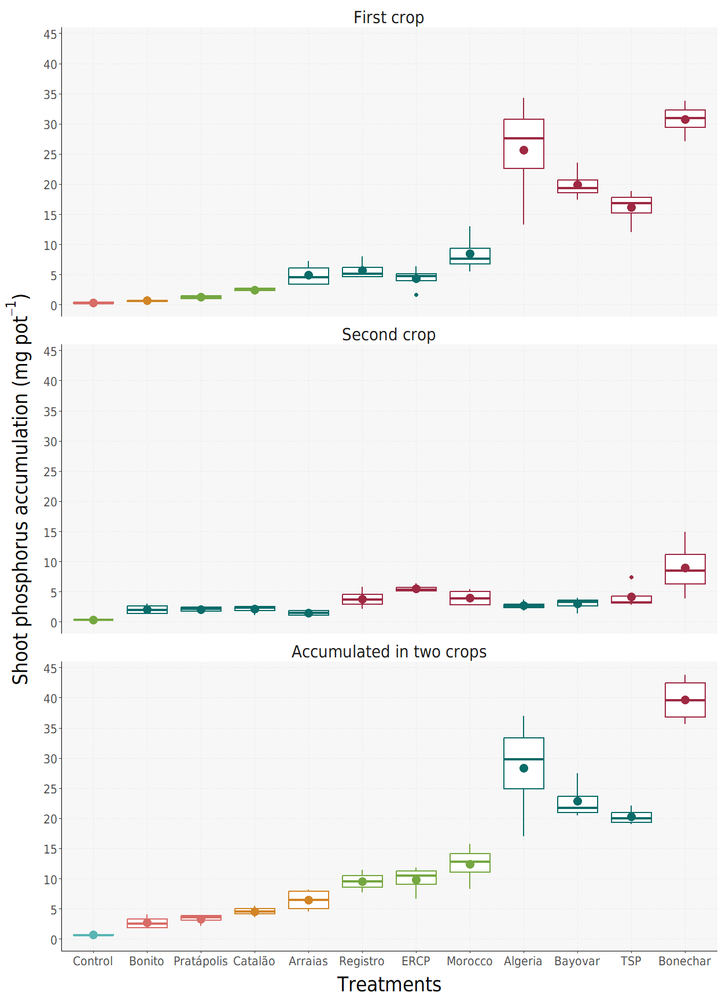<!-- -->

``` r
# Diagrama de pontos para a APPA
ggplot(data = dados, aes(x = trat, y = ap, color = testep)) +
  geom_point(alpha = 0.6, size = 5) +
  geom_text(data = dados_resumop, aes(x = trat, y = mean_ap, label = label), size = 4.5, position = position_nudge(x = 0.45), fontface = "bold") +  
  stat_summary(fun = mean, geom = "point", size = 3, shape = 15) +
  scale_color_manual(values = cores) +
  scale_y_continuous(breaks = seq(0, 45, by = 5)) +
  scale_x_discrete(labels = c(eixo_x), expand = expansion(mult = c(0.05, 0.075))) +
  labs(x = "Treatments", y = "Shoot phosphorus accumulation (mg" ~ pot^-1*")") +
  facet_wrap(~ cult, nrow = 3, ncol = 1, labeller = labeller(cult = facet)) +
  coord_flip() +
  theme_classic() +
  tema
```

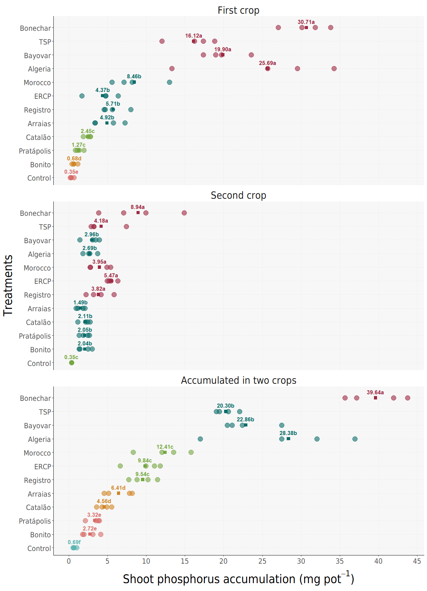<!-- -->

# 4 - Eficiência relativa

## 4.1 - Primeiro ciclo

``` r
# Gerando médias para o cálculo
media <- grupos_media("Primeiro", "mspa", dados, label = "mspa")
```

``` r
# Aplicando a função na tabela
media <- media %>% 
  mutate(efi_rel = eficiencia_relativa(mspa, media))

# Verificando o resultado
media
```

    ## # A tibble: 12 × 3
    ##    trat         mspa efi_rel
    ##    <ord>       <dbl>   <dbl>
    ##  1 Controle    1.05     0   
    ##  2 Bonito      0.586   -3.56
    ##  3 Pratápolis  0.769   -2.16
    ##  4 Catalão     1.47     3.21
    ##  5 Arraias     2.45    10.8 
    ##  6 Registro    2.88    14.0 
    ##  7 Digestato   2.26     9.28
    ##  8 Marrocos    3.50    18.8 
    ##  9 Argélia    10.7     74.4 
    ## 10 Bayóvar    10.7     74.0 
    ## 11 STP        14.1    100   
    ## 12 BoneChar   15.6    112.

## 4.2 - Segundo ciclo

``` r
# Gerando médias para o cálculo
media2 <- grupos_media("Segundo", "mspa", dados, label = "mspa")
```

``` r
# Aplicando a função na tabela
media2 <- media2 %>% 
  mutate(efi_rel = eficiencia_relativa(mspa, media2))

# Verificando o resultado
media2
```

    ## # A tibble: 12 × 3
    ##    trat        mspa efi_rel
    ##    <ord>      <dbl>   <dbl>
    ##  1 Controle   0.314     0  
    ##  2 Bonito     1.75     43.6
    ##  3 Pratápolis 1.72     42.8
    ##  4 Catalão    2.11     54.6
    ##  5 Arraias    1.62     39.8
    ##  6 Registro   2.11     54.7
    ##  7 Digestato  2.86     77.5
    ##  8 Marrocos   3.38     93.2
    ##  9 Argélia    2.26     59.2
    ## 10 Bayóvar    2.49     66.2
    ## 11 STP        3.60    100  
    ## 12 BoneChar   5.73    165.

## 4.3 - Acumulado

``` r
# Gerando médias para o cálculo
medias <- grupos_media("Acumulado", "mspa", dados, label = "mspa")
```

``` r
# Aplicando a função na tabela
medias <- medias %>% 
  mutate(efi_rel = eficiencia_relativa(mspa, medias))

# Verificando o resultado
medias
```

    ## # A tibble: 12 × 3
    ##    trat        mspa efi_rel
    ##    <ord>      <dbl>   <dbl>
    ##  1 Controle    1.36    0   
    ##  2 Bonito      2.33    5.95
    ##  3 Pratápolis  2.49    6.92
    ##  4 Catalão     3.58   13.6 
    ##  5 Arraias     4.08   16.6 
    ##  6 Registro    4.99   22.2 
    ##  7 Digestato   5.12   23.0 
    ##  8 Marrocos    6.87   33.8 
    ##  9 Argélia    13.0    71.3 
    ## 10 Bayóvar    13.2    72.4 
    ## 11 STP        17.7   100   
    ## 12 BoneChar   21.4   123.

# 5 - Eficiência de recuperação de fósforo

## 5.1 - Primeiro ciclo

``` r
# Gerando médias para o cálculo
medip <- grupos_media("Primeiro", "ap", dados, label = "ap")
```

``` r
# Aplicando a função na tabela
medip <- medip %>% 
  mutate(efi_pho = eficiencia_fosforo(ap, medip))

# Verificando o resultado
medip
```

    ## # A tibble: 12 × 3
    ##    trat           ap efi_pho
    ##    <ord>       <dbl>   <dbl>
    ##  1 Controle    0.346    0   
    ##  2 Bonito      0.679    2.11
    ##  3 Pratápolis  1.27     5.88
    ##  4 Catalão     2.45    13.4 
    ##  5 Arraias     4.92    29.0 
    ##  6 Registro    5.71    34.0 
    ##  7 Digestato   4.37    25.5 
    ##  8 Marrocos    8.46    51.4 
    ##  9 Argélia    25.7    161.  
    ## 10 Bayóvar    19.9    124.  
    ## 11 STP        16.1    100   
    ## 12 BoneChar   30.7    192.

## 5.2 - Segundo ciclo

``` r
# Gerando médias para o cálculo
medip2 <- grupos_media("Segundo", "ap", dados, label = "ap")
```

``` r
# Aplicando a função na tabela
medip2 <- medip2 %>% 
  mutate(efi_pho = eficiencia_fosforo(ap, medip2))

# Verificando o resultado
medip2
```

    ## # A tibble: 12 × 3
    ##    trat          ap efi_pho
    ##    <ord>      <dbl>   <dbl>
    ##  1 Controle   0.346     0  
    ##  2 Bonito     2.04     44.3
    ##  3 Pratápolis 2.05     44.5
    ##  4 Catalão    2.11     46.0
    ##  5 Arraias    1.49     29.9
    ##  6 Registro   3.82     90.7
    ##  7 Digestato  5.47    134. 
    ##  8 Marrocos   3.95     94.1
    ##  9 Argélia    2.69     61.2
    ## 10 Bayóvar    2.96     68.3
    ## 11 STP        4.18    100  
    ## 12 BoneChar   8.94    224.

## 5.3 - Acumulado

``` r
# Gerando médias para o cálculo
mediap <- grupos_media("Acumulado", "ap", dados, label = "ap")
```

``` r
# Aplicando a função na tabela
mediap <- mediap %>% 
  mutate(efi_pho = eficiencia_fosforo(ap, mediap))

# Verificando o resultado
mediap
```

    ## # A tibble: 12 × 3
    ##    trat           ap efi_pho
    ##    <ord>       <dbl>   <dbl>
    ##  1 Controle    0.691     0  
    ##  2 Bonito      2.72     10.4
    ##  3 Pratápolis  3.32     13.4
    ##  4 Catalão     4.56     19.8
    ##  5 Arraias     6.41     29.2
    ##  6 Registro    9.54     45.1
    ##  7 Digestato   9.84     46.7
    ##  8 Marrocos   12.4      59.8
    ##  9 Argélia    28.4     141. 
    ## 10 Bayóvar    22.9     113. 
    ## 11 STP        20.3     100  
    ## 12 BoneChar   39.6     199.

# 6 - Gráficos de eficiência

## 6.1 Eficiência agronômica

``` r
# Unindo as duas tabelas em uma
dados_ea <- bind_rows(
  mutate(media, cult = "Primeiro"),
  mutate(medias, cult = "Acumulado")
)

# Ajustando os níveis da variável "cult"
dados_ea$cult <- factor(dados_ea$cult, levels = c("Primeiro", "Acumulado"))

# Visualizando
dados_ea
```

    ## # A tibble: 24 × 4
    ##    trat         mspa efi_rel cult    
    ##    <ord>       <dbl>   <dbl> <fct>   
    ##  1 Controle    1.05     0    Primeiro
    ##  2 Bonito      0.586   -3.56 Primeiro
    ##  3 Pratápolis  0.769   -2.16 Primeiro
    ##  4 Catalão     1.47     3.21 Primeiro
    ##  5 Arraias     2.45    10.8  Primeiro
    ##  6 Registro    2.88    14.0  Primeiro
    ##  7 Digestato   2.26     9.28 Primeiro
    ##  8 Marrocos    3.50    18.8  Primeiro
    ##  9 Argélia    10.7     74.4  Primeiro
    ## 10 Bayóvar    10.7     74.0  Primeiro
    ## # ℹ 14 more rows

``` r
# Gerando o gráfico
fig_ea <- 
ggplot(data = dados_ea) +
  geom_bar(aes(x = trat, y = efi_rel), stat = "identity", position = "stack", alpha = 0.60, fill = "#9e2943") +
  geom_text(aes(label = round(efi_rel, 0), y = efi_rel, x = reorder(trat, efi_rel), vjust = 0.5, hjust = ifelse(efi_rel > 0, 1.5, 0)), family = "DejaVu Sans Condensed") +
  scale_y_continuous(breaks = c(0, 15, 30, 45, 60, 75, 90, 105, 120)) +
  scale_x_discrete(labels = eixo_x) +
  labs(x = "Treatments", y = "Relative efficiency (%)") +
  facet_wrap(~ cult, labeller = labeller(cult = c("Primeiro" = "First crop", "Acumulado" = "Accumulated in two crops"))) +
  coord_flip() +
  theme_classic() +
  tema2

# Visualizando
fig_ea
```

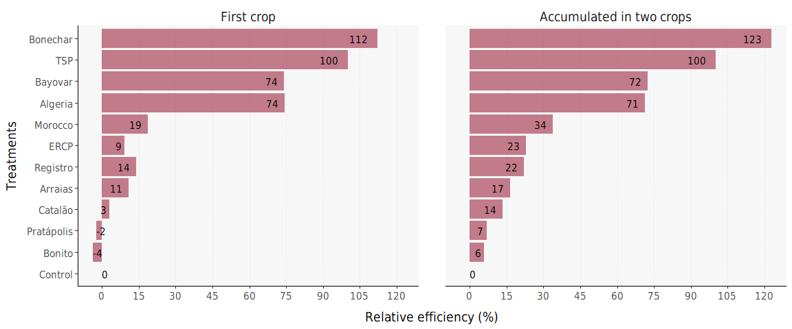<!-- -->

## 6.2 - Eficiência no acúmulo de P

``` r
# Unindo as duas tabelas em uma
dados_ep <- bind_rows(
  mutate(medip, cult = "Primeiro"),
  mutate(mediap, cult = "Acumulado")
)

# Ajustando os níveis da variável "cult"
dados_ep$cult <- factor(dados_ep$cult, levels = c("Primeiro", "Acumulado"))

# Visualizando
dados_ep
```

    ## # A tibble: 24 × 4
    ##    trat           ap efi_pho cult    
    ##    <ord>       <dbl>   <dbl> <fct>   
    ##  1 Controle    0.346    0    Primeiro
    ##  2 Bonito      0.679    2.11 Primeiro
    ##  3 Pratápolis  1.27     5.88 Primeiro
    ##  4 Catalão     2.45    13.4  Primeiro
    ##  5 Arraias     4.92    29.0  Primeiro
    ##  6 Registro    5.71    34.0  Primeiro
    ##  7 Digestato   4.37    25.5  Primeiro
    ##  8 Marrocos    8.46    51.4  Primeiro
    ##  9 Argélia    25.7    161.   Primeiro
    ## 10 Bayóvar    19.9    124.   Primeiro
    ## # ℹ 14 more rows

``` r
# Gerando o gráfico
fig_ep <- 
ggplot(data = dados_ep) +
  geom_bar(aes(x = trat, y = efi_pho), stat = "identity", position = "stack", alpha = 0.60, fill = "#d18525") +
  geom_text(aes(label = round(efi_pho, 0), y = efi_pho, x = reorder(trat, efi_pho), vjust = 0.5, hjust = ifelse(efi_pho >= 0.5, 1.3, ifelse(efi_pho > 0, 0.7, 0))), family = "DejaVu Sans Condensed") +
  scale_x_discrete(labels = eixo_x) +
  scale_y_continuous(breaks = c(0, 30, 60, 90, 120, 150, 180)) +
  labs(x = "Treatments", y = "P use efficiency (%)") +
  facet_wrap(~ cult, labeller = labeller(cult = c("Primeiro" = "", "Acumulado" = ""))) +
  coord_flip() +
  theme_classic() +
  tema2

# Visualizando
fig_ep
```

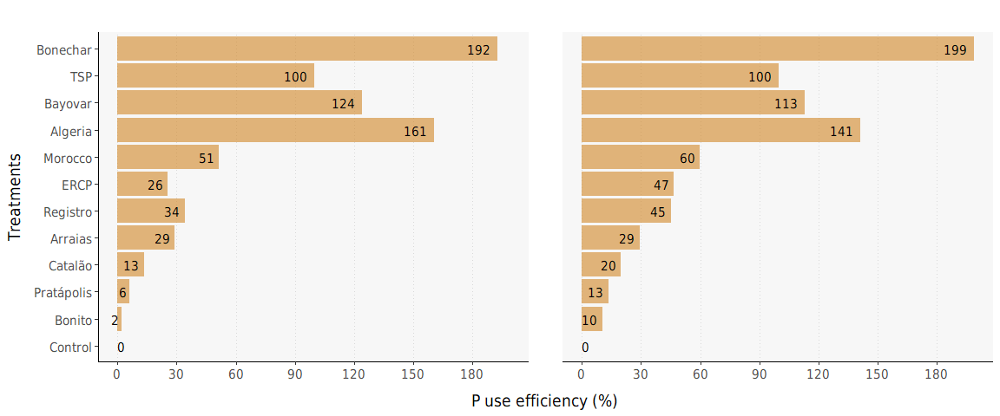<!-- -->

## 6.3 - Juntando os gráficos

``` r
ggarrange(fig_ea, fig_ep, ncol = 1, nrow = 2)
```

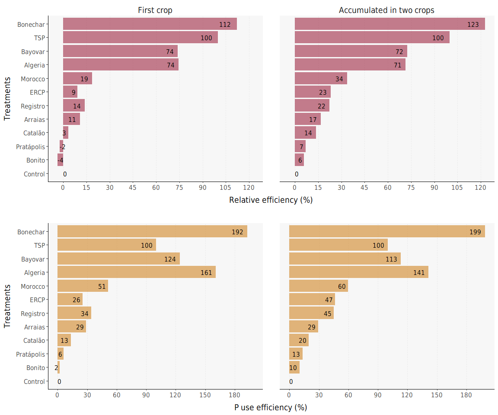<!-- -->
